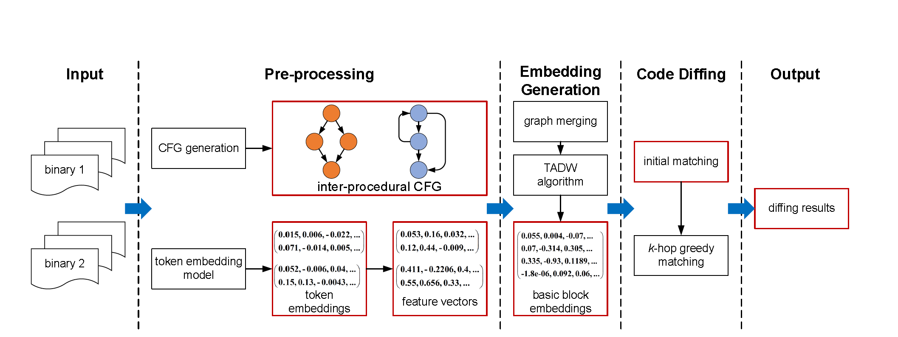
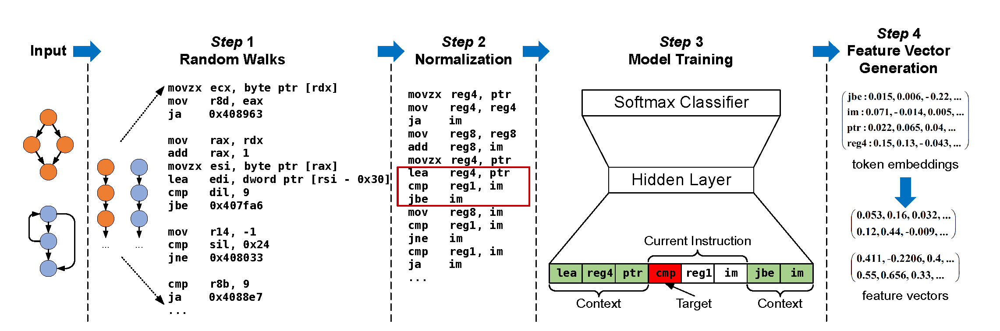
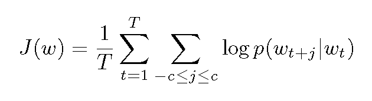
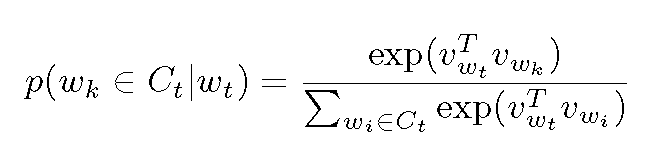
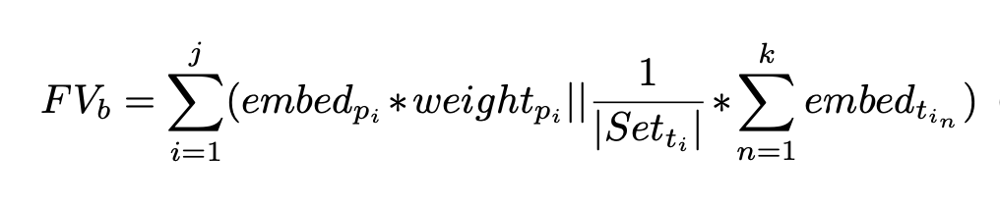
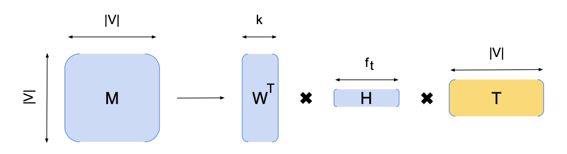
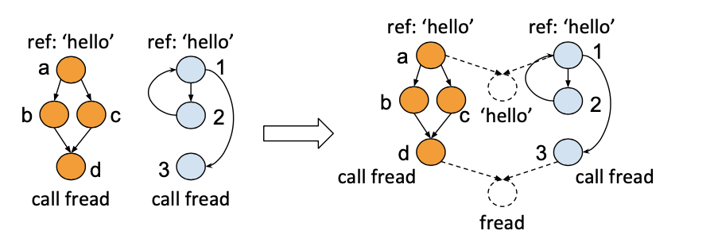
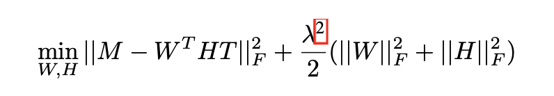
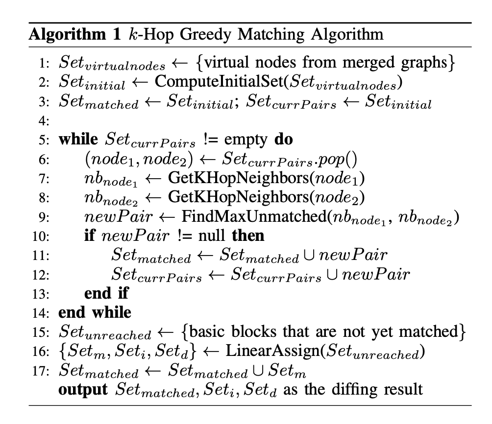
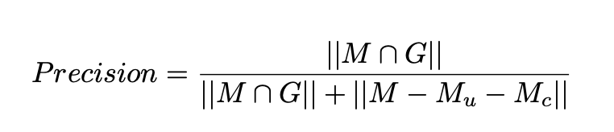

# Summary for DeepBinDiff

## Paper
Learning Program-Wide Code Representations for Binary Diffing

## Source code
https://github.com/deepbindiff/DeepBinDiff

## Introduction

### Binary diffing
> Measure the similarity between two given binaries and produce basic block level matching.

Usages:
+ changed parts locating
+ malware analysis
+ security patch analysis
+ plagiarism detection
+ patch-based exploit

Current problems: 
+ low accuracy
+ poor scalability
+ coarse granularity
+ insufficient training data

### Traditional approaches
**static analysis**
> many-to-many graph isomorphism detection on callgraph and CFG

drawbacks:
+ only consider the syntax of instructions rather than the semantics
+ algorithms are expensive and cannot garantee optimal matching

**dynamic analysis**
> directly executing the given code, performing dynamic slicing or tainting on the given binaries

drawbacks:
+ poor scalability 
+ incomplete code coverage

**learning-based analysis**
> Using deep learning models to perform diffing for better scalability and percision

current limitations:
+ poor granularity(only function level) and not scalable enough
+ program-wide dependency information(from ICFG) not considered
+ supervised learning

## Solution
+ unsupervised program-wide code representation learning technique relying on both semantic information and control flow information
+ a k-hop greedy matching algorithm to find the optimal diffing results using the generated block embeddings

## Details
### Problem defination
Given two binaries:  
p1 = (B1, E1)  
p2 = (B2, E2)  
SIM(p1, p2) = max(sum(sim(m)))
m represents an element in the matching set M(p1, p2)
### Overview

+ preprocessing
    + CFG generation(IDA)
    + feature vector generation
        + Normalization
        + Random Walks
+ embedding generation for basic blocks
+ code diffing
### Feature vector generation
> word2vec model

+ overview

1. utilize random walk result as the sentence
2. normalization
3. use one instruction before and another instruction after to perdict the token with separated opcodes and oprands
4. calculate the cost function and perform gradient descent

5. average and concatenate the embeddings of opcodes and oprands to construct the basic block feature vector

### embedding generation
> TADW algorithm  
+ Overview

2. Graph merging  
Treat system calls and library fucntions as shared virtual nodes which can boost similarity between different basic blocks and alleviate calculation expense.

3. Training  
Equivalent to matrix factorization. We can fix and minimize W and H alternatively to minimize the loss function.

### Code Diffing
> k-hop Greedy matching algorithm and Hungarian algorithm
+ Overview

## Evaluation
+ current SOTA BinDiff and Asm2Vec
+ various binaries(113 C binaries and 10 C++ binaries)
+ cross-version and cross-optimizaton-level diffing

### Ground truth collection
> Myers algorithm: text based matching for the source code in order to get the line number matching
+ ignore modified ones and removes code statements leading to multiple basic blocks
### Metrics
+ percision

+ recall

### Parameter selection
+ k: number of hops
+ t: threshold: for filtering matched pairs

## Case Study
+ OpenSSL using real-world vulnerabilities

## Discussion
+ could mistakenly categorize some blocks as insertions or deletions since the system performs one-to- one block matching
+ vulnerable to obfuscation and packing due to relying on control flow information
+ no support for cross-architecture diffing
